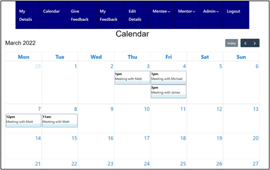
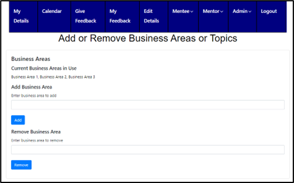
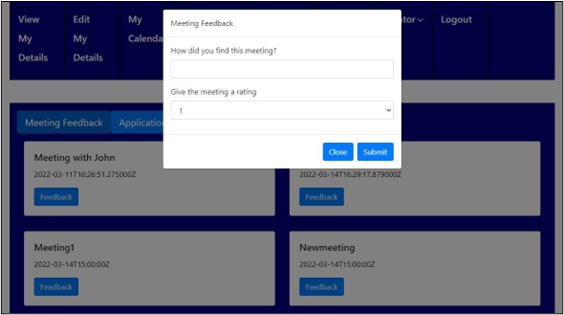
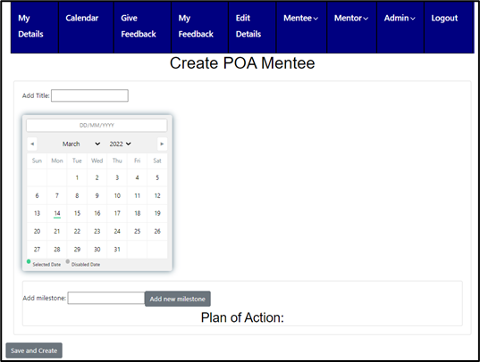
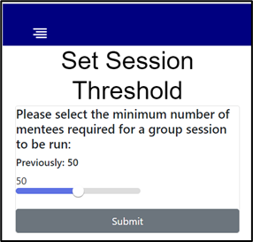

# Mentoring Software for Deutsche Bank

This project was a group sponsored project from Deutsche Bank, to create am mentoring service for their internal use.

The project has features such as meeting booking and organisation, areas of expertise and feedback. Experts in a certain business area can create
meetings that other users can join.

Users can leave feedback on meertings and create plans of action for improvement.

The project was built with a React frontend using bootstrap and a Django backend as this already included a lot of functionality we desired.

# Screenshots

- 
- 
- 
- 
- 

### Installation and Running Instructions

* Install Node.js, NPM and pipenv
* Run `npm install` to install the required packages
* `cd` into the root directory of the project
* Create a virtual environment with `virtualenv <environment-name>`
* Start the virtual environment with running `pipenv shell`
* Install the required packages within this virtual environment: `pipenv install requirements.txt`
* Still in the virtual environment, `cd` into the `mentoringsystem` directory
* To start the backend server, run `python manage.py runserver`
* In another terminal, `cd` into the `frontend` directory
* To start the frontend site, run `npm run start`
* The backend should run on `localhost:8000` and the frontend on `localhost:3000` by default
* We have provided an account with username admin and password admin which has access to all of the functionalities (mentee, mentor and admin) of the system
* Note that the system uses a Google Cloud hosted database, which will be kept up at least until marking is over
